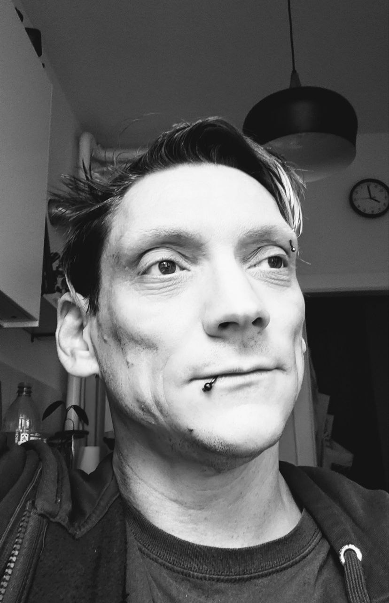

Aside
================================================================================

{width=80%}

Contact Info {#contact}
--------------------------------------------------------------------------------

- <i class="fa fa-envelope"></i> tobias.anton.85@gmail.com
- <i class="fa fa-github"></i> [github.com/marauderpixie](https://github.com/marauderpixie)
- <i class="fa fa-globe"></i> [tobiasanton.eu](https://tobiasanton.eu)
- <i class="fa fa-phone"></i> +49 173-453-5865
- For more information, please contact me via email.

Skills {#skills}
--------------------------------------------------------------------------------

- Advanced experience in bayesian and frequentist statistical analysis and modeling

- Passionate about data visualization, exploration and communication

- Highly skilled in R, R-Shiny, Stan, Continuous Integration and LaTeX

Disclaimer {#disclaimer}
--------------------------------------------------------------------------------

<!-- This resume was made with the R package [**pagedown**](https://github.com/rstudio/pagedown). -->

Last updated on `r format(Sys.time(), '%d. %b, %Y')`.

Main
================================================================================

Tobias Anton {#title}
--------------------------------------------------------------------------------

### some introductory line I haven't thought of yet

Hier kommt ein total motivierter Text hin, in dem ich entweder was zu mir sage oder wonach ich eigentlich suche. If you are interested in my background and skills, please feel free to contact me.

Education {data-icon=graduation-cap data-concise=true}
--------------------------------------------------------------------------------

### Universität Osnabrück

**M.Sc. in Cognitive Science**  
major topics: Artificial Intelligence and Cognitive Psychology

Osnabrück, Germany

2022

Thesis: _On the role of rule instructions and ordering in category learning_

### Universität Bremen

**B.Sc. in Psychology**  
major topics: Work & Organizational Psychology and Neuroscience

Bremen, Germany

2018

Thesis: _Feedback-modulierte quasi-realistische binäre Entscheidungen in einem wetterbasierten Kontext_

Professional Experience {data-icon=suitcase}
--------------------------------------------------------------------------------

### Scientific Assistant

at the Cognitive Modeling Group, Uni Osnabrück  
- Collaboration in the writing of an online-textbook on Scientific Data Analysis ([link](https://michael-franke.github.io/intro-data-analysis/))  
- Tutor on Advanced Bayesian Data Analysis  
- Tutor on Experimental Psychology Lab  
- Tutor on Introduction to Data Analysis  
- Implementation of online experiments  
- Research on scientific articles for replication by students

Osnabrück, Germany

2019 - 2022

### Student Assistant

at Fachbereich 11 of Uni Bremen  
- Tutor on Statistics I & II  
- Tutor on Experimental Practice  
- Lectures in Statistical Programming with R ([link](https://r-intro.tadaa-data.de/))  
- Tutor on Statistical Data Analysis (R)

Bremen, Germany

2015 - 2021

